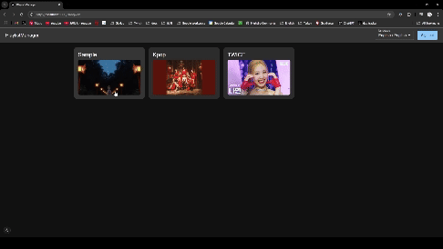

<h2 align="center">PlaylistManager</h2>
<div align="center">Youtube (music) プレイリストマネージャー</div>



## 機能
- WebGUI から Youtube プレイリストを管理する
- プレイリストをコピー
- プレイリストのアイテムをシャッフル
- プレイリスト同士を結合
- プレイリストを削除
- プレイリストのアイテムを検索する
- 多言語対応（英語 & 日本語）

## ロードマップ
- [x] プレイリストをコピー
- [x] プレイリストを削除
- [x] プレイリストのアイテムをシャッフル
- [x] プレイリスト同士を結合
- [x] 多言語対応 (英語 & 日本語)
- [x] プレイリストのアイテムを検索する
- [ ] プレイリストから特定の歌手名で抽出する
- [ ] プレイリストのアイテムを歌手名や曲名でソートする
- [ ] マルチプラットフォーム対応 (Youtube, Spotify, Amazon music ...)

## 使用方法
このアプリケーションをクローンして実行するには、[Git](https://git-scm.com), [Node.js](https://nodejs.org/en/download/), [pnpm](https://pnpm.io/) がインストールされている必要があります。
コマンド: 
```bash
# このリポジトリをクローンする
$ git clone https://github.com/suzuki3jp/PlaylistManager.git

# リポジトリに移動する
$ cd PlaylistManager

#`app/sample.env` を `app/.env` に変更し、適切な値を入力する

# 依存関係のインストール
$ pnpm install

# アプリケーションの実行
$ pnpm dev
```
## License

[MIT License](./LICENSE)

## Disclaimer

PlaylistManager is an independently developed application that utilizes the YouTube Data API to streamline playlist management through features such as copying, shuffling, merging, and deleting playlists.

This application is not affiliated with, endorsed by, or in any way officially connected to YouTube or Google. All product and company names are trademarks™ or registered® trademarks of their respective holders.

Users must comply with YouTube's Terms of Service, and it is the user's responsibility to ensure compliance with all applicable terms and conditions when using this application.

The developer accepts no responsibility or liability for any damages, losses, or consequences that may arise from the use of this application. Use of this application is entirely at your own risk.